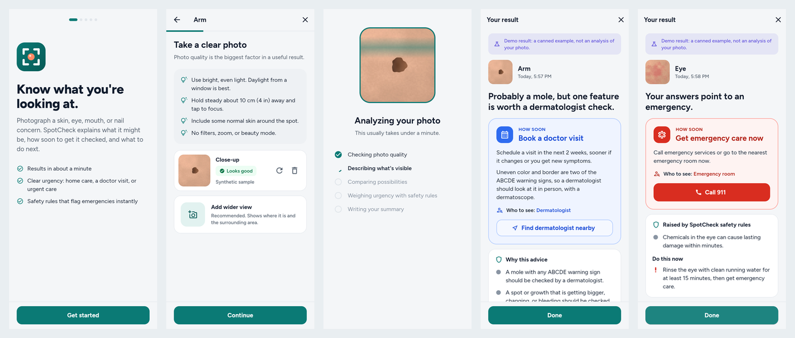
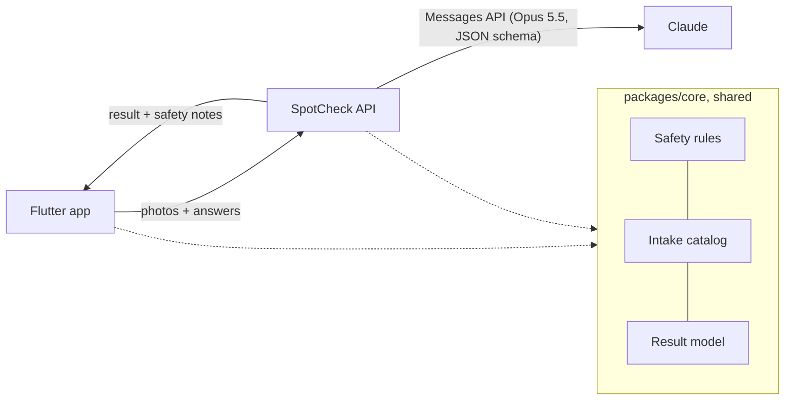

# SpotCheck

Photograph a skin, eye, mouth, nail, or scalp concern and find out what it
might be, how soon to get it seen, and by whom. Built with Flutter and
Claude Opus 5.5.



SpotCheck is a triage tool, not a diagnosis. It never tells anyone they're
fine; it tells them what's likely, what would be worrying, and whether to
use home care, book a visit, or get care today. That framing is what makes
it safe, and it's how the app can ship in the App Store today (see
[docs/LAUNCH.md](docs/LAUNCH.md)).

## How it stays accurate and safe

1. **Photo quality gate.** Each photo is checked on the device for blur,
   darkness, glare, and resolution before upload, and the model can ask for
   a retake instead of guessing.
2. **Clinical intake.** 17 short questions (the ABCDE mole signs, the glass
   test for rashes, eye red flags, etc.) because history matters as much as
   the image.
3. **Structured reasoning.** Claude Opus 5.5 at high effort, with the output
   constrained to a JSON schema that makes it judge quality and describe what
   it sees before naming conditions and deciding urgency.
4. **Deterministic safety floor.** 49 rules in
   [`safety_rules.dart`](packages/core/lib/src/safety_rules.dart) set a
   minimum urgency from the answers. They can only make advice more
   cautious; the model can't talk its way below them. Emergencies are
   caught before any AI runs.
5. **Measured, not assumed.** An evaluation harness runs the production
   pipeline over Google's SCIN dermatology dataset and reports accuracy,
   serious-case under-triage, and accuracy by skin tone.

Details: [docs/ACCURACY.md](docs/ACCURACY.md).

## Repository

```
app/            Flutter app (iOS, Android, web)
server/         Dart API that calls Claude (stateless; nothing is stored)
packages/core/  Shared Dart: intake questions, safety rules, result model,
                photo pipeline (used by the app, server, and eval)
eval/           SCIN converter and evaluation docs
docs/           Product plan, accuracy, launch/regulatory guide
```



## Quick start

Requires Flutter 3.47+ (Dart 3.13).

**Run the app in demo mode** (no server or API key; results are canned,
clearly labeled, and photos can be synthetic samples):

```bash
cd app
flutter run -d chrome        # or an iOS simulator / Android emulator
```

**Run the real analysis server:**

```bash
cd server
export ANTHROPIC_API_KEY=sk-ant-...
dart run bin/server.dart     # listens on :8080
```

**Point the app at it:**

```bash
cd app
flutter run --dart-define=API_BASE_URL=http://localhost:8080
# Android emulator: use http://10.0.2.2:8080
```

`SPOTCHECK_FAKE_MODEL=true dart run bin/server.dart` runs the server
without a key, returning demo results.

### Server configuration

| Variable | Default | |
|---|---|---|
| `ANTHROPIC_API_KEY` | (required) | Keep it on the server; never ship it in the app |
| `SPOTCHECK_MODEL` | `claude-opus-5-5` | |
| `SPOTCHECK_EFFORT` | `high` | `low` to `max`. Opus 5.5's API default is `medium`; triage warrants more |
| `SPOTCHECK_ENSEMBLE_SIZE` | `1` | Independent samples merged cautiously (up to 5) |
| `SPOTCHECK_FALLBACKS` | `true` | Server-side fallback if a safety classifier declines a benign medical photo |
| `SPOTCHECK_CORS_ORIGINS` | `*` | Comma-separated; restrict in production |
| `SPOTCHECK_RATE_LIMIT_*` | 6 checks per install per burst, refills 1 per 10 min | Also per IP |
| `PORT` | `8080` | |

Settings are namespaced on purpose: Claude Code sets a generic
`CLAUDE_EFFORT` in its own terminals, which would otherwise silently switch
the server to max effort.

### Deploy the server

Build from the repo root (the image needs `packages/core`), push, and run
it on any container host. With Cloud Run:

```bash
IMAGE=us-docker.pkg.dev/YOUR_PROJECT/spotcheck/api
docker build -f server/Dockerfile -t $IMAGE . && docker push $IMAGE
gcloud run deploy spotcheck-api --image $IMAGE \
  --set-secrets ANTHROPIC_API_KEY=anthropic-key:latest \
  --set-env-vars SPOTCHECK_CORS_ORIGINS=https://your.domain
```

The image is a ~10 MB AOT binary on `scratch`. Health data is never
written to disk or logs; logs carry only ids, status, urgency, latency,
and token cost.

## Tests

```bash
(cd packages/core && dart test)   # intake, safety rules, triage, photo pipeline
(cd server && dart test)          # Claude client, analyzer, API, eval scoring
(cd app && flutter test)          # onboarding, full check, emergency, paywall
```

Every safety rule is exercised by at least one scenario test, and a test
fails if one is added without coverage. CI runs all of the above plus a
web build (`.github/workflows/ci.yml`).

## Measure accuracy

```bash
python3 eval/scin_to_manifest.py --out eval/data/scin/manifest.jsonl --sample 300 --serious-first
cd server
ANTHROPIC_API_KEY=... dart run bin/eval.dart --manifest ../eval/data/scin/manifest.jsonl --limit 50 --max-cost 10
```

See [eval/README.md](eval/README.md).

## Before you launch

The app is feature-complete for a first TestFlight build, but a few things
are deliberately left for you, because they need your accounts or legal
review: real purchases (RevenueCat), App Check, excluding health photos
from iCloud backup, privacy policy and terms, and a regulatory review of
the claims. The checklist is in [docs/LAUNCH.md](docs/LAUNCH.md), and the
business plan is in [docs/PRODUCT.md](docs/PRODUCT.md).
